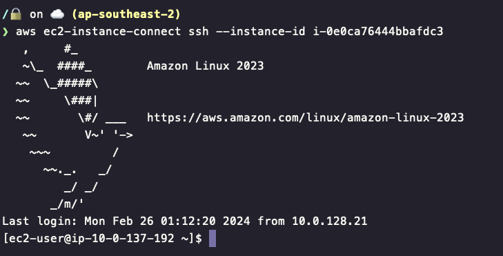
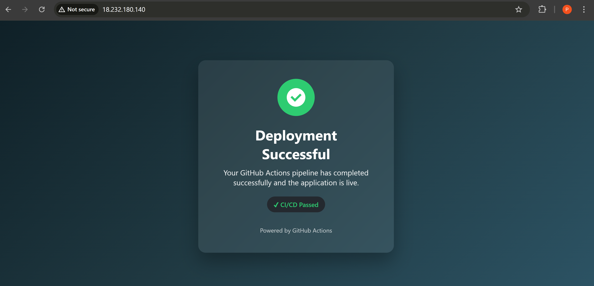
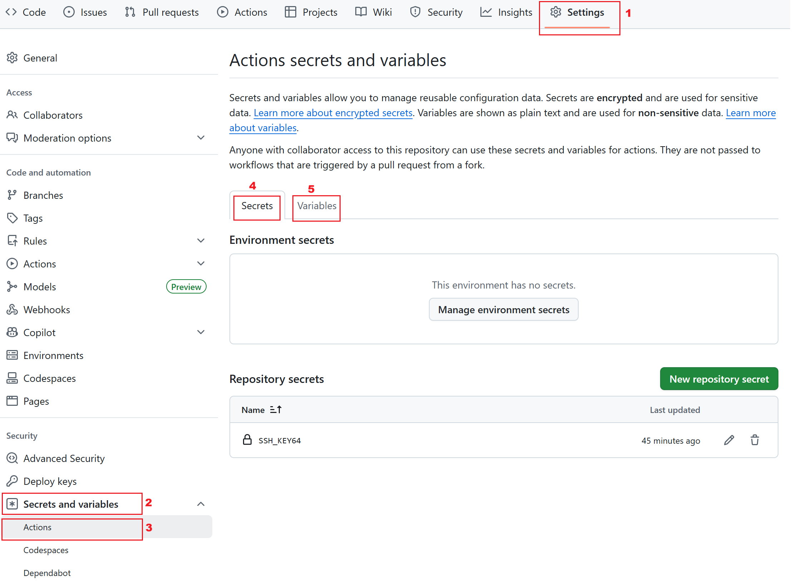
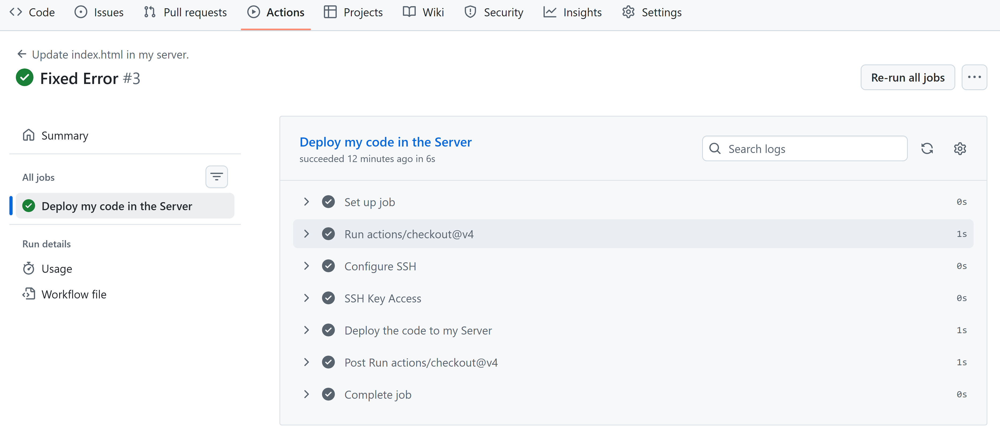
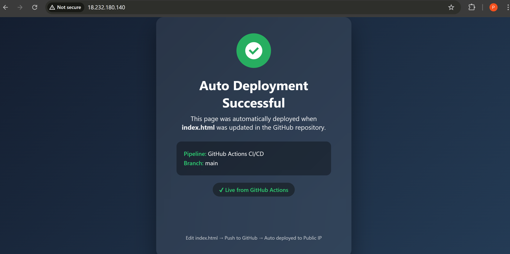

# Complete Guide: Automating Web Deployment with GitHub Actions

## Overview

This guide walks you through setting up continuous deployment for a static website using GitHub Actions, AWS EC2, and Nginx. By the end, any changes you push to your GitHub repository will automatically update your live website.

## Prerequisites

- An AWS account with EC2 access
- A GitHub account
- Basic knowledge of command line operations
- A local development environment with Git installed

---

## Part 1: Setting Up Your EC2 Instance

### Step 1: Launch an EC2 Instance

1. Log into your AWS Console and navigate to EC2
2. Click "Launch Instance"
3. Choose an Amazon Linux 2 AMI
4. Select an instance type (t2.micro is sufficient for testing)
5. Configure instance details as needed

### Step 2: Configure Security Group

Your EC2 instance needs to accept web traffic:

1. In the security group settings, add an inbound rule:
   - **Type:** HTTP
   - **Protocol:** TCP
   - **Port Range:** 80
   - **Source:** 0.0.0.0/0 (allows traffic from anywhere)

2. Ensure SSH (port 22) is also enabled for your IP address

3. Launch the instance and save your key pair file (e.g., `terraform-key.pem`)

### Step 3: Install Nginx

Connect to your EC2 instance via SSH:

```bash
ssh -i terraform-key.pem ec2-user@<your-ec2-public-ip>
```


Install and start Nginx:

```bash
sudo yum update -y
sudo yum install nginx -y
sudo systemctl start nginx
sudo systemctl enable nginx
```

Verify Nginx is running by visiting your EC2 public IP in a browser. You should see the Nginx welcome page.

---

## Part 2: Creating and Preparing Your GitHub Repository

### Step 4: Create a GitHub Repository

1. Go to GitHub and create a new repository (e.g., `ci-cd`)
2. Don't initialize it with any files yet

### Step 5: Initialize Local Repository

On your local machine:

```bash
mkdir ci-cd
cd ci-cd
git init
```

### Step 6: Create Your Website Content

Create a simple `index.html` file:

```bash
nano index.html
```

Add some basic HTML content:

```html
<!DOCTYPE html>
<html>
<head>
    <title>My Automated Website</title>
</head>
<body>
    <h1>Hello from GitHub Actions!</h1>
    <p>This page updates automatically.</p>
</body>
</html>
```

### Step 7: Push to GitHub

```bash
git add .
git commit -m "Initial commit"
git branch -M main
git remote add origin https://github.com/YourUsername/ci-cd.git
git push -u origin main
```

---

## Part 3: Configuring the EC2 Server for Git

### Step 8: Navigate to Nginx Directory

SSH back into your EC2 instance and navigate to the Nginx web root:

```bash
cd /usr/share/nginx
ls
```

You'll see two folders: `html` and `modules`. The `html` folder is where your website files are served from.

### Step 9: Change Folder Permissions

By default, the `html` folder is owned by root. Change ownership to your user:

```bash
sudo chown -R ec2-user:ec2-user html
```

### Step 10: Backup and Clear the HTML Folder

Create a backup of the original content:

```bash
sudo cp -R html html-bkp
```

Clear the html folder:

```bash
cd html
rm -rf *
```

### Step 11: Install Git

```bash
sudo yum install git -y
```

### Step 12: Clone Your Repository

You have two options:

**Option 1:** Clone into a subfolder and move files

```bash
git clone https://github.com/YourUsername/ci-cd.git
cd ci-cd
mv index.html ../
cd ..
rm -rf ci-cd
```

**Option 2:** Clone directly into the current directory (recommended)

```bash
git clone https://github.com/YourUsername/ci-cd.git .
```

The `.` at the end tells Git to clone the contents directly into the current folder without creating a subfolder.

### Step 13: Test Your Website

Visit your EC2 public IP address in a browser. You should now see your custom `index.html` page instead of the Nginx welcome page.


---

## Part 4: Setting Up GitHub Actions for Automation

### Step 14: Create GitHub Actions Workflow

In your local repository, create the necessary folder structure:

```bash
mkdir -p .github/workflows
```

Create a workflow file:

```bash
nano .github/workflows/deploy.yaml
```

### Step 15: Add Workflow Configuration

Paste the following YAML configuration:

```yaml
name: Update index.html in my server

on: 
  push:
    branches:
      - main

jobs:
  deploymycode:
    name: "Deploy my code in my server"
    runs-on: ubuntu-latest
    env:
      SERVER_IP: ${{ vars.SERVER_IP }}
    
    steps: 
      - uses: actions/checkout@v4
      
      - name: "Configure SSH"
        run: |
          mkdir -p ~/.ssh
          chmod 700 ~/.ssh
          echo -e "Host *\n\tStrictHostKeyChecking no\n\n" > ~/.ssh/config
          cat ~/.ssh/config
          touch ~/.ssh/known_hosts
          chmod 600 ~/.ssh/known_hosts
      
      - name: "SSH Key Access"
        run: |
          touch mykey.pem
          echo "$SSH_KEY64" | base64 -d > mykey.pem && chmod 400 mykey.pem
          ssh-keygen -R $SERVER_IP
        env:
          SSH_KEY64: ${{ secrets.SSH_KEY64 }}
      
      - name: "Deploy the code to my server"
        run: |
          ssh -t ec2-user@$SERVER_IP -i mykey.pem 'cd /usr/share/nginx/html && git pull origin main'
```

### Understanding the Workflow

- **Trigger:** Runs automatically when you push to the `main` branch
- **Environment:** Runs on Ubuntu (GitHub's servers)
- **Steps:**
  1. **Checkout:** Downloads your repository code
  2. **Configure SSH:** Sets up SSH configuration to connect without manual confirmation
  3. **SSH Key Access:** Decodes your private key from base64 and prepares it for use
  4. **Deploy:** Connects to your EC2 instance and pulls the latest code

---

## Part 5: Configuring GitHub Secrets and Variables

### Step 16: Encode Your SSH Key

On your local machine, encode your EC2 private key to base64:

```bash
base64 terraform-key.pem
```

Copy the entire output (it will be a long string).

### Step 17: Add Repository Variables



1. Go to your GitHub repository
2. Click **Settings** → **Secrets and variables** → **Actions**
3. Click the **Variables** tab
4. Click **New repository variable**
5. Add:
   - **Name:** `SERVER_IP`
   - **Value:** Your EC2 public IP address (e.g., `54.123.45.67`)

### Step 18: Add Repository Secrets

1. Click the **Secrets** tab
2. Click **New repository secret**
3. Add:
   - **Name:** `SSH_KEY64`
   - **Value:** Paste the base64-encoded key from Step 16

---

## Part 6: Testing Your Automation

### Step 19: Make a Change and Push

Update your `index.html` file:

```html
<!DOCTYPE html>
<html>
<head>
    <title>My Automated Website</title>
</head>
<body>
    <h1>Hello from GitHub Actions!</h1>
    <p>This page updates automatically.</p>
    <p><strong>Last updated: January 5, 2026</strong></p>
</body>
</html>
```

Commit and push:

```bash
git add .
git commit -m "Update homepage with timestamp"
git push origin main
```

### Step 20: Monitor the Workflow

1. Go to your GitHub repository
2. Click the **Actions** tab
3. You should see your workflow running
4. Click on it to view detailed logs of each step



### Step 21: Verify the Update

Once the workflow completes successfully (green checkmark), refresh your website in the browser. You should see the updated content immediately.


---

## Troubleshooting

### Common Issues and Solutions

**Workflow fails at SSH step:**
- Verify your `SERVER_IP` variable is correct
- Ensure your security group allows SSH from GitHub Actions IPs
- Check that `SSH_KEY64` secret matches your EC2 key pair

**Permission denied errors:**
- Verify the ownership of `/usr/share/nginx/html` is set to `ec2-user`
- Check that the folder is a Git repository (`ls -la` should show `.git`)

**Website doesn't update:**
- SSH into EC2 and manually run `git pull origin main` in `/usr/share/nginx/html`
- Check Nginx is running: `sudo systemctl status nginx`
- Verify file permissions

**Base64 encoding issues:**
- Ensure you copied the entire base64 output without line breaks
- The decoded key should be exactly the same as your original `.pem` file

---

## Security Best Practices

1. **Rotate keys regularly:** Change your SSH keys periodically
2. **Limit IP access:** Restrict SSH access to specific IP ranges when possible
3. **Use IAM roles:** For production, consider using AWS IAM roles instead of SSH keys
4. **Monitor Actions logs:** Regularly review your GitHub Actions logs for suspicious activity
5. **Enable branch protection:** Require pull request reviews before merging to `main`

---
